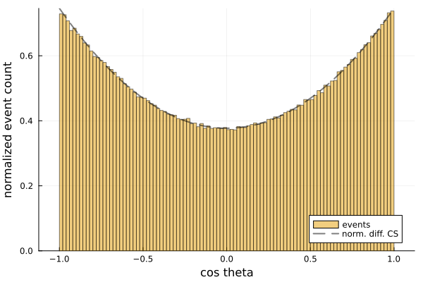

## READ ME FIRST

This project is presented as an example of how you'd develop a complete project in Julia. The rest of this README is written for an "imaginary user" of the complete project. If you are using this project, or its template, as an exercise in learning Julia, you should *ignore* this README, as you should work from the git repo you created.

# HEPExampleProject.jl

[](https://JuliaHEP.github.io/HEPExampleProject.jl/dev)
[](LICENSE.md)
[](https://github.com/JuliaHEP/HEPExampleProject.jl/actions/workflows/CI.yml)
[](https://codecov.io/gh/JuliaHEP/HEPExampleProject.jl)

`HEPExampleProject.jl` is a demonstration package for showcasing how to develop software
in the context of high-energy physics (HEP) using the Julia programming language. This project
serves as a template for researchers, developers, and students interested in adopting Julia
for HEP-specific workflows.

## Key Features

- **HEP-Focused Design**: Structures common to high-energy physics are implemented with a focus on performance and flexibility.
- **Modular Architecture**: Designed to be easily extensible for new use cases and HEP-related calculations.
- **Integration with JuliaHEP**: Part of the [JuliaHEP](https://github.com/JuliaHEP) ecosystem, which aims to facilitate the use of Julia in high-energy physics research and analysis.

## Installation

This package is not registered (and most probably will never be).

To install `HEPExampleProject.jl`, use Julia's built-in package manager. In the Julia REPL, type:

```julia
julia> using Pkg
julia> Pkg.add("https://github.com/JuliaHEP/HEPExampleProject.jl")
```

Alternatively, you can enter the Pkg mode by pressing `]` in the REPL, then type:

```julia
pkg> add https://github.com/JuliaHEP/HEPExampleProject.jl
```

## Usage

Once installed, you can begin using `HEPExampleProject.jl` by importing the package:

```julia
using HEPExampleProject
```

### Example

The following example demonstrates a simple use of the package:

```julia
using HEPExampleProject
using Random

# define random number generator for reproducibility
RNG = Xoshiro(137)

# Define some input parameters for the HEP process
incoming_electron_energy = 1000.0

# generate 1M events
event_list = generate_events_cpu(RNG,incoming_electron_energy,1_000_000)
```

If you separately install the package `Plots` (`pkg> add Plots`), you can plot
the generated events:

```Julia
using Plots
plot(event_list)
```



You can also plot event lists using via the Makie plotting system, by using
one of the Makie plotting backends (CairoMakie, WGLMakie, etc.):

```Julia
using CairoMakie
plot(event_list)
```

### Executable

An example executable using the `HEPExampleProject.jl` package is provided in the `bin/` directory. The executable can be run from the project's root directory with:

```bash
julia --project bin/hepexample.jl
```
or included in a Julia REPL with:

```julia
julia> include("bin/hepexample.jl"); main(ARGS)
```

#### Compilation

The example executable can be compiled to a standalone binary.

Follow the instructions from [JuliaC.jl](https://github.com/JuliaLang/JuliaC.jl) to install `juliac`.
Then compile the executable by running the following from the project's root directory:

```bash
juliac --project . --output-exe hepexample  bin/hepexample.jl --experimental --trim=unsafe-warn
```

The compiled executable can then be run with:
```bash
./hepexample
```

## Contributing

We welcome contributions to improve this project! If you're interested in contributing, please:

1. Fork the repository.
2. Create a new branch for your feature or bug fix.
3. Submit a pull request with a detailed description of your changes.

You can also open an issue if you encounter any problems or have feature suggestions.

## Acknowledgements

This project is part of the JuliaHEP ecosystem, which is developed by a community of scientists
and developers passionate about using Julia for high-energy physics. We are grateful to
all contributors and users who support the growth of this project.

## License

`HEPExampleProject.jl` is licensed under the MIT License.
See the [LICENSE](https://github.com/JuliaHEP/HEPExampleProject.jl/blob/main/LICENSE) file for more details.
